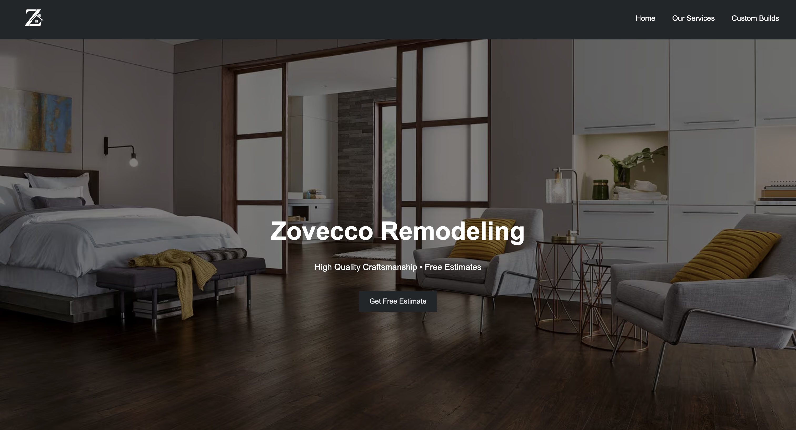
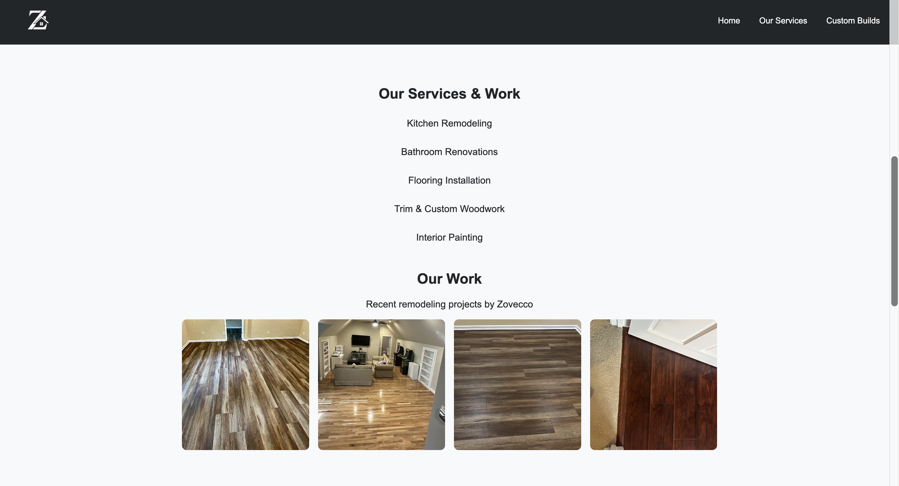
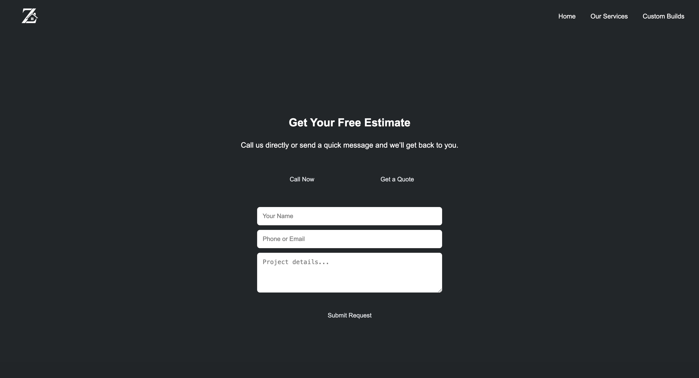

# Zovecco Website

A full-stack business website built to handle customer inquiries through a contact form with real email delivery.

---

## 🚀 Live Demo

- 🌐 Frontend: https://zovecco.netlify.app  
- ⚙️ Backend API: https://zovecco-site.onrender.com

---

## 📌 Features

- Responsive modern website UI
- Smooth navigation between sections
- Contact form with validation
- Real-time form submission to backend API
- Email notifications via Nodemailer (Gmail SMTP)
- Full-stack deployment (frontend + backend separated)

---

## 🛠️ Tech Stack

### Frontend
- React (Vite)
- JavaScript (ES6+)
- CSS (custom styling)

### Backend
- Node.js
- Express.js
- Nodemailer
- CORS

### Deployment
- Netlify (Frontend)
- Render (Backend)

---

## 📩 How It Works

1. User fills out contact form
2. React frontend sends POST request to backend API
3. Express server receives data
4. Nodemailer sends email notification
5. Message is delivered to business inbox

---

## 📸 Screenshots

### Home

Landing page showing hero section and branding.

### Services

Overview of flooring services offered.

### Contact

Lead capture form connected to backend API.

---

## 🔥 What I Learned

- Full-stack architecture (frontend ↔ backend communication)
- REST API creation using Express
- Email integration with Nodemailer
- Deployment workflows using Netlify and Render
- Environment configuration and CORS handling

---

## 📦 Future Improvements

- Add database (MongoDB) to store leads
- Admin dashboard to view submissions
- Auto-reply emails to customers
- Improved analytics tracking
